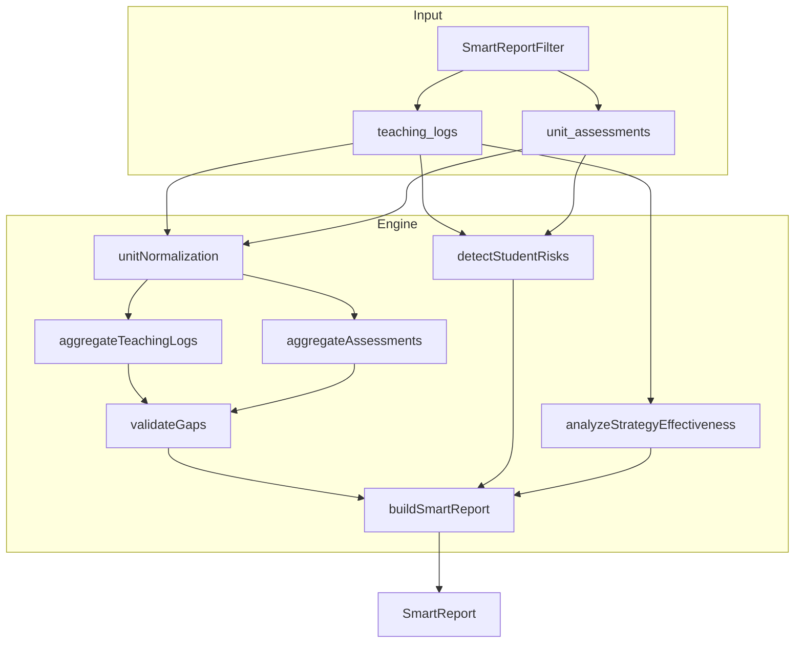

# Phase C: Smart Report Implementation Plan

## Context

Phase C ต่อจาก Phase A/B: เปรียบเทียบ teaching_logs (mastery, gap) กับ unit_assessments (คะแนนสอบ) ออกรายงานสมรรถนะพร้อม gap validation, risk detection, และ strategy effectiveness.

**DB:** `teaching_logs` ใช้ `learning_unit`, `unit_assessments` ใช้ `unit_name` — รูปแบบต่างกัน ต้องใช้ unit normalization.

**การปรับแก้ตามข้อเสนอ:**

- ใช้ `@/integrations/supabase/client` (ไม่ใช่ `@/lib/supabase`)
- `remedial_ids` เป็น `string | null`
- Mode tie-break: เมื่อ major_gap frequency เท่ากัน ให้ใช้ค่าจาก log ล่าสุด
- หน่วยที่มีแค่ assessments: รวมใน report ไม่ข้าม
- เทอมที่มีแค่หน่วยเดียว: จัดการ edge case ใน risk detection
- เตรียม `teacher_id` filter เมื่อ RLS แข็งแรง

---

## Part 1: Types และ Unit Normalization

**ไฟล์ที่สร้าง**

### `src/types/smartReport.ts`

```ts
// Core types ตาม Claude + ปรับแก้
interface TeachingLogRaw {
  id: string;
  learning_unit: string | null;
  next_strategy: string | null;
  major_gap: string;
  mastery_score: number;
  remedial_ids: string | null;
  teaching_date: string;
  subject: string;
  grade_level: string;
  classroom: string;
  academic_term: string | null;
  // ... fields ที่ต้องใช้
}
interface UnitTeachingAggregate { unitKey: string; displayName: string; logs: TeachingLogRaw[]; dominantGap: string; ... }
interface UnitAssessmentAggregate { unitKey: string; assessments: ...; avgScorePct: number; ... }
interface GapValidationResult { unitKey: string; teachingGap: string; assessmentAvgPct: number; verdict: "aligned"|"overperformed"|"needs_work"; ... }
interface StudentRiskProfile { studentId: string; unitKey: string; remedialCount: number; scorePct: number | null; risk: "high"|"medium"|"low"; ... }
interface StrategyEffectivenessResult { unitKey: string; strategy: string; gapBefore: string; gapAfter: string; effectiveness: "positive"|"neutral"|"negative"; ... }
export interface SmartReport { ... }
```

### `src/lib/unitNormalization.ts`

ฟังก์ชันหลัก:

- `extractUnitNumber(s: string | null): number | null` — ดึงเลขหน่วยจาก "หน่วยที่ 1", "Unit 1", "หน่วย 1", etc.
- `toUnitKey(n: number): string` — เช่น `"unit-1"`
- `normalizeUnit(raw: string | null): { unitKey: string; displayName: string } | null`
- `sortByUnitKey(keys: string[]): string[]` — เรียงหน่วยตามเลข

**Unit test:** `src/lib/__tests__/unitNormalization.test.ts` — ทดสอบ extractUnitNumber กับรูปแบบภาษาไทย/อังกฤษหลายแบบ

---

## Part 2: Queries

**ไฟล์ที่สร้าง:** `src/lib/smartReportQueries.ts`

```ts
import { supabase } from "@/integrations/supabase/client";

export interface SmartReportFilter {
  subject: string;
  gradeLevel: string;
  classroom: string;
  academicTerm: string;
  teacherId?: string; // เตรียมไว้สำหรับ RLS
}

export async function fetchTeachingLogs(filter: SmartReportFilter): Promise<TeachingLogRaw[]>
export async function fetchUnitAssessments(filter: SmartReportFilter): Promise<UnitAssessmentRaw[]>
```

ใช้ `.eq()` filter ตาม subject, grade_level, classroom, academic_term; ถ้ามี teacherId ให้เพิ่ม `.eq("teacher_id", teacherId)` (optional).

---

## Part 3: Engine Core

**ไฟล์ที่สร้าง:** `src/lib/smartReportEngine.ts`

ฟังก์ชันหลัก:

1. **aggregateTeachingLogs(logs)** → `UnitTeachingAggregate[]`
  - Group by unit (ใช้ normalizeUnit)
  - dominantGap: นับ major_gap frequency → **เมื่อเท่ากัน ใช้ค่าจาก log ที่ teaching_date ล่าสุด (mode tie-break)**
  - รวม next_strategy, mastery trend
2. **aggregateAssessments(assessments)** → `UnitAssessmentAggregate[]`
  - Group by unit (normalize unit_name)
  - **รวมหน่วยที่มีแค่ assessments (ไม่มี logs) ใน report ไม่ข้าม**
3. **validateGaps(teachingAgg, assessmentAgg)** → `GapValidationResult[]`
  - เทียบ dominantGap กับ avgScorePct → verdict
4. **detectStudentRisks(logs, assessments)** → `StudentRiskProfile[]`
  - **เทอมเดียวหน่วยเดียว:** ใช้ threshold ปรับ (เช่น ไม่ให้ risk สูงเกินจริงเมื่อข้อมูลน้อย)
5. **analyzeStrategyEffectiveness(logs)** → `StrategyEffectivenessResult[]`
  - ดู next_strategy ต่อ unit ก่อน-หลัง
6. **buildSmartReport(filter, logs, assessments)** → `SmartReport`
  - รวมทุก aggregate + merge หน่วยจากทั้ง logs และ assessments

**Unit tests:** `src/lib/__tests__/smartReportEngine.test.ts` — ทดสอบ validateGaps, detectStudentRisks กับชุดข้อมูลจำลอง

---

## Part 4: Hook

**ไฟล์ที่สร้าง:** `src/hooks/useSmartReport.ts`

```ts
export function useSmartReport(filters: SmartReportFilter) {
  const { data: logs, ... } = useQuery({ queryKey: ["smart-logs", filters], queryFn: () => fetchTeachingLogs(filters) });
  const { data: assessments, ... } = useQuery({ queryKey: ["smart-assessments", filters], queryFn: () => fetchUnitAssessments(filters) });
  const report = useMemo(() => buildSmartReport(filters, logs ?? [], assessments ?? []), [filters, logs, assessments]);
  return { report, logs, assessments, isLoading, error };
}
```

---

## Part 5: Page และ UI Components

### `src/pages/SmartReportView.tsx`

โครงหน้า:

- ReportFilters (subject, grade, classroom, academic term) — คล้าย [DashboardFilters.tsx](src/components/dashboard/DashboardFilters.tsx)
- SummaryStatsBar — สรุปหน่วย, คะแนนเฉลี่ย
- UnitReportTable — ตารางรายหน่วย (teaching aggregate + assessment + gap verdict)
- StudentRiskList — รายชื่อนักเรียนเสี่ยง
- StrategyEffectivenessCard — สรุปกลยุทธ์ที่มีผล
- ปุ่ม Export PDF (ใช้ jsPDF + jspdf-autotable — ตาม plan เดิม)

Component ย่อยอยู่ใน `src/components/smart-report/`:

- `ReportFilters.tsx`
- `SummaryStatsBar.tsx`
- `UnitReportTable.tsx`
- `StudentRiskList.tsx`
- `StrategyEffectivenessCard.tsx`

---

## Part 6: Routing, Sidebar, และ Tests

1. **App.tsx** — เพิ่ม route `/smart-report` ( ProtectedRoute สำหรับ teacher + director)
2. **AppSidebar.tsx** — เพิ่มเมนู "รายงานสมรรถนะ" / "Smart Report" (สำหรับ teacher + director)
3. **Unit tests** — สร้าง/ขยาย tests ตาม Part 1 และ Part 3

---

## Implementation Order (ทีละส่วน)


| ลำดับ | ส่วน              | ไฟล์หลัก                                                 | ผลลัพธ์                         |
| ----- | ----------------- | -------------------------------------------------------- | ------------------------------- |
| 1     | Types + Unit Norm | `types/smartReport.ts`, `lib/unitNormalization.ts`       | พื้นฐาน + unit test             |
| 2     | Queries           | `lib/smartReportQueries.ts`                              | ดึง logs + assessments          |
| 3     | Engine            | `lib/smartReportEngine.ts`                               | buildSmartReport + engine tests |
| 4     | Hook              | `hooks/useSmartReport.ts`                                | React Query + memo report       |
| 5     | Page + UI         | `pages/SmartReportView.tsx`, `components/smart-report/`* | หน้าแสดงผลครบ                   |
| 6     | Route + Sidebar   | `App.tsx`, `AppSidebar.tsx`                              | เข้าถึงได้จากเมนู               |


---

## Diagram: Data Flow




