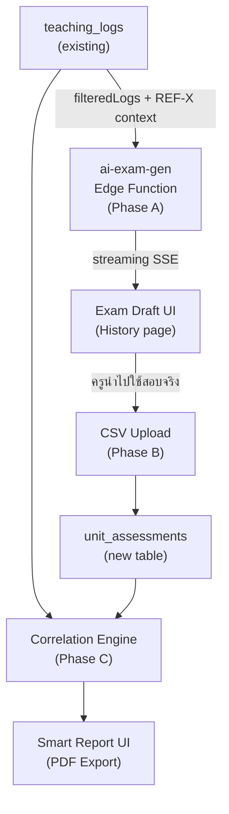

# Smart Assessment Integration Plan

## Overview

เพิ่มระบบ Feedback Loop ระหว่างบันทึกการสอน (teaching_logs) กับผลการประเมิน (unit_assessments) ใน 3 Phase




---

## Phase A: AI Exam Assistant

### 1. New Edge Function: `supabase/functions/ai-exam-gen/index.ts`

- Copy structure จาก `ai-lesson-plan/index.ts`
- Request body: `{ topic, gradeLevel, classroom, subject, numQuestions, context }`
- `context` = output ของ `buildContextWithCitation(filteredLogs)` จาก client
- System prompt บังคับ:
  - สร้างข้อสอบ 10 ข้อ แบ่งตาม Bloom's Taxonomy (Remember/Understand/Apply)
  - ทุกข้อต้องอ้างอิง `[REF-X]` จากบันทึกจริง ห้ามมโนหัวข้อที่ไม่เคยสอน
  - output format: JSON array `[{ question, type, bloom_level, ref, answer_key }]`
- Model: `google/gemini-2.5-flash`, `temperature: 0`, streaming SSE

### 2. UI: ปุ่ม "สร้างข้อสอบ" ใน `src/pages/History.tsx`

- เพิ่มปุ่มที่ 4 ต่อจากปุ่ม Eye (ดูรายละเอียด)
- เปิด `<Dialog>` แสดง exam draft แบบ streaming (เหมือน lesson plan)
- มีปุ่ม Copy และ Export .docx

---

## Phase B: Assessment CSV Upload

### 1. Database: ตาราง `unit_assessments` (รัน SQL ใน Supabase)

```sql
CREATE TABLE public.unit_assessments (
  id UUID PRIMARY KEY DEFAULT gen_random_uuid(),
  teacher_id UUID REFERENCES auth.users(id) NOT NULL,
  student_id TEXT NOT NULL,
  subject TEXT NOT NULL,
  grade_level TEXT NOT NULL,
  classroom TEXT NOT NULL,
  academic_term TEXT,
  unit_name TEXT,
  score NUMERIC NOT NULL,
  total_score NUMERIC NOT NULL DEFAULT 10,
  assessed_date DATE,
  teaching_log_ref UUID REFERENCES public.teaching_logs(id),
  created_at TIMESTAMPTZ DEFAULT now()
);
```

### 2. อัปเดต `src/integrations/supabase/types.ts`

- เพิ่ม `unit_assessments` Row/Insert/Update type

### 3. อัปเกรด `src/pages/UploadCSV.tsx`

- เพิ่ม Tab selector: "บันทึกการสอน" (existing) | "คะแนนประเมิน" (new)
- Tab ใหม่: parse CSV format `Student_ID | Score | Total | Subject | Grade | Classroom | Term | Unit`
- เพิ่ม entries ใน `HEADER_MAP` ใน `src/lib/csvImport.ts` หรือสร้าง parser แยก `assessmentImport.ts`
- Duplicate check: `student_id + subject + grade_level + classroom + academic_term + unit_name`

---

## Phase C: Smart Report (Correlation Engine)

### 1. New Page: `src/pages/SmartReport.tsx`

- Filter: subject + grade + classroom + academic_term + unit_name
- ดึงข้อมูล 2 ชุดพร้อมกัน:
  - `teaching_logs` (filtered) → mastery trend + gap history
  - `unit_assessments` (filtered) → คะแนนรายนักเรียน
- Correlation logic (client-side):
  - นักเรียนที่อยู่ใน `remedial_ids` บ่อย → เปรียบเทียบกับ `score / total_score`
  - ถ้า gap = k-gap แต่คะแนนสูง → "ครูแก้ไขได้สำเร็จ"
  - ถ้า gap = p-gap และคะแนนต่ำ → "ยังต้องการ Active Practice"

### 2. AI Summary ใน Smart Report

- เรียก `ai-chat` Edge Function พร้อม context ที่รวม:
  - `buildContextWithCitation(filteredLogs)` (existing)
  - assessment summary: `[SCORE-X] นักเรียน ID: ... คะแนน: .../10`
- AI วิเคราะห์ correlation และออก verdict พร้อม citation

### 3. PDF Export

- ใช้ `jsPDF` + `jspdf-autotable`
- รายงานต่อนักเรียน: ชื่อ, คะแนน, gap history, AI verdict + citation

---

## ไฟล์ที่ต้องสร้าง/แก้ไข

- สร้างใหม่: `supabase/functions/ai-exam-gen/index.ts`
- สร้างใหม่: `src/pages/SmartReport.tsx`
- สร้างใหม่: `src/lib/assessmentImport.ts`
- แก้ไข: `src/pages/History.tsx` (เพิ่มปุ่ม + dialog)
- แก้ไข: `src/pages/UploadCSV.tsx` (เพิ่ม tab)
- แก้ไข: `src/integrations/supabase/types.ts` (เพิ่ม unit_assessments)
- แก้ไข: `src/App.tsx` (เพิ่ม route `/smart-report`)
- แก้ไข: `src/components/AppSidebar.tsx` (เพิ่ม menu item)
- รัน SQL: สร้าง `unit_assessments` table + RLS policy ใน Supabase Dashboard

